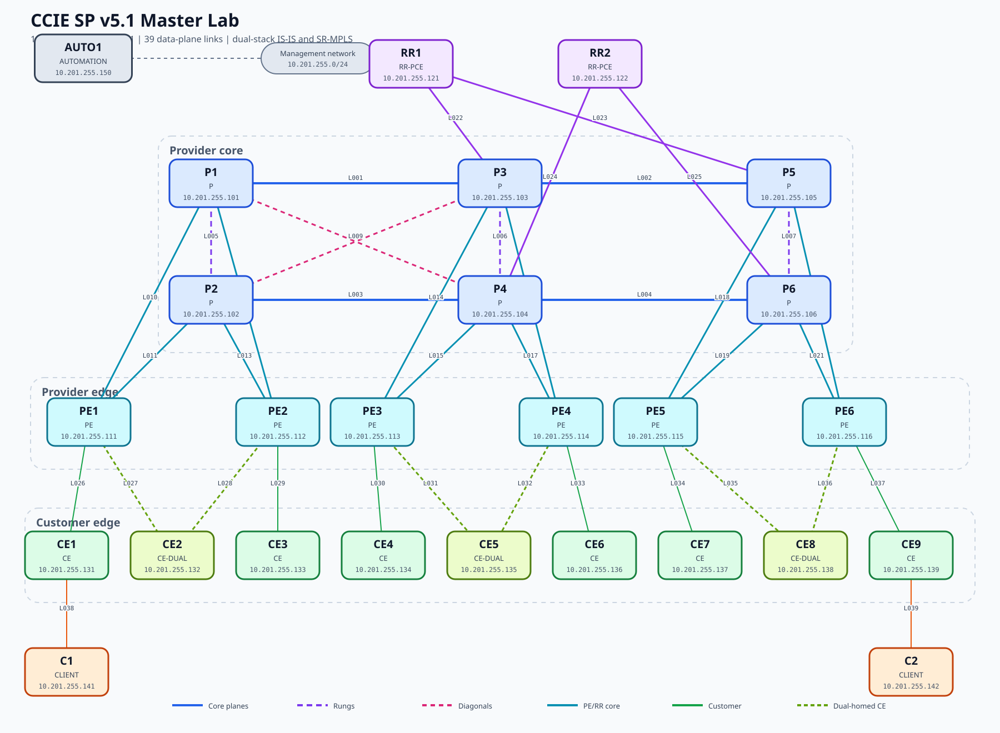

# CCIE SP v5.1 Master Lab

Reproducible 30-node service-provider lab for Cisco CCIE Service Provider
v5.1 practice. It combines a redundant dual-stack ISP backbone, customer
services, Segment Routing and a dedicated automation workstation.



The diagram is generated from the authoritative node and link inventories.
Orange `NEW` markers identify the validated 2026 expansion: P7, P8, PE7 and
PE8, connected through links `L040-L047`.

## Current implementation status

The 30-node `master` profile is deployed and its expanded IS-IS, SR-MPLS and
RR control plane has been validated. P7, P8, PE7 and PE8 are included in the
diagram and use link identifiers `L040-L047`.

The Inter-AS and SRv6 profiles currently have approved design documents but
are not yet runnable topologies. AAA/RPKI and the remaining service phases are
also intentionally pending. See [Deployment status](STATUS.md) for the exact
acceptance boundary before moving to the next profile.

## What this repository contains

- A 30-node Containerlab topology generated from Python.
- Eight P, eight PE and two redundant RR/PCE XRd nodes.
- Nine customer-edge and two client IOL-XE nodes.
- `AUTO1`, a reproducible Ansible/Python/pyATS automation workstation.
- IPv4/IPv6 addressing, IS-IS and SR-MPLS configuration phases.
- Validation, backup and read-only command tools.
- The decisions, failures and platform limitations discovered during the build.

## Documentation

| Guide | Purpose |
|---|---|
| [Complete build guide](docs/BUILD-GUIDE.md) | Step-by-step history, resources and design decisions |
| [Architecture](docs/ARCHITECTURE.md) | Nodes, roles, redundancy and study modules |
| [Addressing](docs/ADDRESSING.md) | Management, loopbacks, links, IS-IS and SIDs |
| [Automation](docs/AUTOMATION.md) | AUTO1 design, tools and learning path |
| [AUTO1 Source of Truth](docs/AUTO1-SOURCE-OF-TRUTH.md) | BGP render, validation, diff, deploy and post-check workflow |
| [Multi-profile roadmap](docs/MULTI-PROFILE-ROADMAP.md) | Master, Inter-AS and SRv6 design and acceptance gates |
| [Validation](docs/VALIDATION.md) | Repeatable health and protocol checks |
| [Troubleshooting](docs/TROUBLESHOOTING.md) | Errors encountered and their resolutions |
| [IPv6 standard](IPV6-STANDARD.md) | Provider-specific IPv6 control-plane standard |
| [Operations](OPERATIONS.md) | Daily lifecycle and quick commands |
| [Blueprint matrix](BLUEPRINT-MATRIX.md) | Mapping to CCIE SP v5.1 domains |
| [Security](SECURITY.md) | Credential, image and publishing precautions |

## Architecture

| Role | Platform | Nodes |
|---|---|---|
| Provider core | XRd 24.2.11 | P1-P8 |
| Provider edge | XRd 24.2.11 | PE1-PE8 |
| Route reflector and PCE | XRd 24.2.11 | RR1-RR2 |
| Customer edge | IOL-XE 17.12.1 | CE1-CE9 |
| Customer test endpoints | IOL-XE 17.12.1 | C1-C2 |
| Automation workstation | Ubuntu 24.04 container | AUTO1 |

Total: 18 XRd nodes, 11 IOL nodes, one automation workstation, and 47
data-plane links.

The P backbone has two longitudinal planes, three inter-plane rungs, and two
diagonal paths. Every PE is dual-homed to a pair of P routers. RR1 and RR2
also provide redundant PCE roles. CE2, CE5, and CE8 are dual-homed customer
sites for PE-CE loop prevention and EVPN/L2VPN exercises.

## Images

```text
ios-xr/xrd-control-plane:24.2.11
vrnetlab/cisco_iol:17.12.01
```

The IOL artifact supplied in the folder named `17.15.01` was verified by CLI
as Dublin 17.12.1. This project deliberately uses the truthful image tag.

## Management

```text
Subnet: 10.201.255.0/24
Docker network: ccie-sp-master-mgmt
Ubuntu next hop from Windows: 192.168.192.10
```

Node addresses are listed in `inventory/nodes.csv`.

## Generated files

Run:

```bash
python3 tools/build_lab.py
```

This generates:

```text
topology/ccie-sp-master.clab.yml
inventory/nodes.csv
inventory/links.csv
configs/00-base/
configs/10-isis/
configs/15-provider-standard/
configs/20-sr-mpls/
```

The source of truth is `tools/build_lab.py`; generated files should not be
edited by hand.

## Configuration phases

1. `00-base`: hostnames, dual-stack loopbacks, link addressing, descriptions.
2. `10-isis`: dual-stack IS-IS Level 2, metrics, LFA and convergence.
3. `15-provider-standard`: non-destructive migration of the existing provider
   IPv6 plan plus the common P/PE/RR operational standard.
4. `20-sr-mpls`: SRGB, dual-stack Prefix-SIDs and the SR-TE hierarchy.
5. `30-bgp-rr`: dual route reflectors and VPNv4/VPNv6.
6. `40-l3vpn`: PE-CE routing and shared/extranet services.
7. `50-sr-te-pce`: SR policies, PCC/PCE, disjointness, affinity, and SRLG.
8. `60-multicast`: PIM, RP designs, mLDP, Tree-SID, and NG-mVPN.
9. `70-l2vpn-evpn`: VPWS, VPLS, EVPN, IRB, and multihoming.
10. `80-security-assurance`: AAA/RADIUS, LPTS, RPKI, telemetry, gNMI, and TWAMP.
11. `90-failure-drills`: BFD, TI-LFA, BGP-PIC, PCE failover, and faults.

Phases 30-90 are intentionally developed and validated incrementally. This
keeps each baseline exam-like and prevents untested feature combinations from
being hidden in one enormous startup configuration.

## Provider addressing standard

The deployed IPv4 addresses are immutable in the refinement phase:

```text
Provider loopbacks: 10.0.0.<node-id>/32
Point-to-point:     10.255.0.0/31 onward
```

The provider IPv6 plan follows the requested CCIE SP convention:

```text
Provider loopbacks: 2001:db8:500:abcd::<node-id>/128
Provider links:     2001:db8:1000:<101-125>::/127
```

Customer-facing IPv6 links retain their own access block and are not placed in
the provider IS-IS underlay.

## Automation

`AUTO1` uses `ccie-sp-automation:1.0` at `10.201.255.150`. See
`automation/README.md` for its Ansible, Python, pyATS/Genie, NETCONF and gNMI
examples.

## Platform boundaries

XRd Control Plane is suitable for the routing, MPLS, SR, VPN, PCE, security,
and model-driven management portions of this lab. Physical clocking,
line-card-specific QoS, real MACsec, optical behavior, and some L2 data-plane
counters require either design study or an on-demand XRv9k/physical platform.
