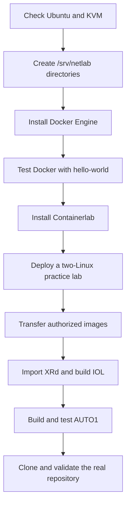

<h1 align="center">
  Containerlab Host, Image, and AUTO1 Build Guide
</h1>

<div align="center">

**A beginner-friendly, technically complete path from a clean Ubuntu server to a validated CCIE Service Provider lab host**

</div>


---

<div align="center">

**From a Windows workstation to a validated multi-profile Containerlab host**

[Architecture](#2-validated-architecture) —
[Docker](#5-docker-engine-installation) —
[Containerlab](#7-containerlab-installation) —
[Transfer images](#8-transfer-licensed-images-from-windows) —
[XRd](#9-import-the-cisco-xrd-image) —
[IOL-XE](#10-build-the-cisco-iol-xe-vrnetlab-image) —
[AUTO1](#12-build-auto1) —
[Acceptance](#15-acceptance-checklist)

</div>

---

This document records how the validated CCIE Service Provider environment was
built. It explains the host decision, Docker and Containerlab installation,
licensed-image transfer, local image construction, AUTO1 creation, verification,
and the operational controls used to protect the workstation.

> [!IMPORTANT]
> This repository does not contain Cisco software, licenses, passwords, private
> keys, or device backups. Obtain every network operating-system artifact from
> an authorized source and comply with the applicable vendor license.

> [!NOTE]
> Commands containing names, addresses, or paths from the validated environment
> are concrete examples. Confirm the current username, VM address, filenames,
> and disk layout before executing them on another installation.

## 0. Read this first

This guide is intentionally written in two layers:

- **Simple explanation:** what the step means and why it exists.
- **Technical procedure:** exact commands, expected output, and stop conditions.

You do not need to memorize every command. Copy one block at a time, read its
output, and continue only when the checkpoint says **PASS**.

### 0.1 What you are building

Think of the environment as four boxes inside one another:

```text
Windows computer
  `-- VMware Workstation
      `-- Ubuntu Server VM (netlab-core)
          |-- Docker Engine
          |-- Containerlab
          |-- Network containers: XRd and IOL
          `-- Linux automation containers: AUTO1 and SOURCE1
```

- **Ubuntu Server** is the machine that does the work.
- **Docker** starts and stops containers.
- **Containerlab** reads a YAML topology and connects container interfaces.
- **XRd/IOL** are the virtual routers.
- **AUTO1** is the automation workstation.
- **SOURCE1** is the Linux traffic generator used by ISP-2.

### 0.2 What this guide will not do

This guide does not provide Cisco software, licenses, keys, or passwords. It
also does not automate the manual ISP-2 study protocols. Obtain every
proprietary artifact from an authorized source.

### 0.3 Safe learning rule

When a command begins with `sudo`, it can change the host. Read it before
pressing Enter. Never replace a specific path with `/`, `$HOME`, or a guessed
directory. Never run broad cleanup commands copied from the Internet.

### 0.4 Installation roadmap



### 0.5 Fast checklist

- [ ] Ubuntu is supported and updated.
- [ ] `/dev/kvm` exists.
- [ ] Docker reports both client and server versions.
- [ ] `hello-world` exits successfully.
- [ ] `containerlab version` works.
- [ ] The two-Linux example can ping across `eth1`.
- [ ] Cisco artifacts remain outside Git.
- [ ] XRd, IOL, and AUTO1 canaries pass.
- [ ] Only one heavy profile is active at a time.

## 1. Why Containerlab

Containerlab was selected for topology-as-code, deterministic Linux wiring,
Docker-based lifecycle control, and direct integration with Git, Ansible, and
Python. It complements EVE-NG rather than replacing it: EVE-NG remains useful
for interactive GUI work, while Containerlab makes generation, validation,
destruction, and reconstruction repeatable.

Containerlab orchestrates nodes and links. It does not supply Cisco images or
licenses.

## 2. Validated architecture

```text
Windows workstation
+-- VMware Workstation
    +-- Ubuntu Server VM: netlab-core
        +-- nested AMD-V/KVM
        +-- Docker Engine with overlay2
        +-- Containerlab 0.77.0
        +-- /srv/netlab/docker      Docker data root
        +-- /srv/netlab/images      licensed local image staging
        +-- /srv/netlab/labs        Git working copies and topologies
        +-- /srv/netlab/backups     repository and device backups
```

Ubuntu Server was selected instead of the desktop Arch VM because the lab host
needed predictable services, dedicated `/srv/netlab` storage, and a stable
automation environment. The CCIE-SP master profile was initially validated
with 12 vCPU and 60 GiB RAM. The VM was later expanded to 16 vCPU and roughly
65 GiB visible RAM. Resource measurements, not allocated values alone, decide
whether a profile is safe to start.

## 3. Host and nested-virtualization checks

Run these checks before installing or starting a lab:

```bash
uname -a
cat /etc/os-release
nproc
free -h
df -h / /srv/netlab
uptime
systemd-detect-virt
ls -l /dev/kvm

test -r /sys/module/kvm_amd/parameters/nested && \
  cat /sys/module/kvm_amd/parameters/nested
test -r /sys/module/kvm_intel/parameters/nested && \
  cat /sys/module/kvm_intel/parameters/nested
```

Expected results are a readable `/dev/kvm`, nested virtualization enabled, no
swap pressure, and sufficient free space under `/srv/netlab`. Run only one
heavy profile (`master`, `inter-as`, or `srv6`) at a time.

## 4. Directory preparation

```bash
sudo mkdir -p \
  /srv/netlab/docker \
  /srv/netlab/images/cisco/xrd/24.2.11 \
  /srv/netlab/images/cisco/iol/17.12.01 \
  /srv/netlab/labs \
  /srv/netlab/backups

sudo chown -R "$USER":"$USER" \
  /srv/netlab/images \
  /srv/netlab/labs \
  /srv/netlab/backups
```

The licensed-image staging directory is deliberately outside the Git working
copy. The root `.gitignore` also rejects common image extensions as a second
control.

## 5. Docker Engine installation

Docker is the service that creates containers. Containerlab asks Docker to
create routers and Linux nodes, but Containerlab cannot work if Docker is
missing or stopped.

The commands below follow Docker's official Ubuntu APT-repository method.

### 5.1 Remove conflicting packages

On a new host, remove packages that can conflict with Docker CE. It is safe if
APT says a package is not installed:

```bash
for package in docker.io docker-doc docker-compose docker-compose-v2 \
  podman-docker containerd runc; do
  sudo apt-get remove -y "$package"
done
```

This does not delete a separately configured Docker data directory. On an
existing Docker host, stop and inventory workloads before changing packages.

### 5.2 Update Ubuntu and install repository tools

```bash
sudo apt-get update
sudo apt-get install -y ca-certificates curl
```

What this does:

- `apt-get update` refreshes Ubuntu's package catalog.
- `ca-certificates` lets the host verify HTTPS certificates.
- `curl` downloads Docker's signing key.

Checkpoint:

```bash
curl --version
```

### 5.3 Add Docker's official signing key

```bash
sudo install -m 0755 -d /etc/apt/keyrings
sudo curl -fsSL https://download.docker.com/linux/ubuntu/gpg \
  -o /etc/apt/keyrings/docker.asc
sudo chmod a+r /etc/apt/keyrings/docker.asc
```

Verify that the file exists and is not empty:

```bash
test -s /etc/apt/keyrings/docker.asc && \
  echo 'PASS: Docker signing key exists' || \
  echo 'STOP: Docker signing key missing'
```

### 5.4 Add Docker's Ubuntu repository

```bash
sudo tee /etc/apt/sources.list.d/docker.sources >/dev/null <<EOF
Types: deb
URIs: https://download.docker.com/linux/ubuntu
Suites: $(. /etc/os-release && echo "${UBUNTU_CODENAME:-$VERSION_CODENAME}")
Components: stable
Architectures: $(dpkg --print-architecture)
Signed-By: /etc/apt/keyrings/docker.asc
EOF
```

Read the file before continuing:

```bash
cat /etc/apt/sources.list.d/docker.sources
```

The suite should match the Ubuntu codename and the architecture should match
`dpkg --print-architecture`.

### 5.5 Install Docker Engine

```bash
sudo apt-get update
sudo apt-get install -y \
  docker-ce \
  docker-ce-cli \
  containerd.io \
  docker-buildx-plugin \
  docker-compose-plugin
```

Package meanings:

| Package | Purpose |
|---|---|
| `docker-ce` | Docker daemon/service |
| `docker-ce-cli` | `docker` command |
| `containerd.io` | Container runtime used by Docker |
| `docker-buildx-plugin` | Modern image builder |
| `docker-compose-plugin` | `docker compose` command |

### 5.6 Start Docker at boot

```bash
sudo systemctl enable --now docker
sudo systemctl is-active docker
sudo systemctl is-enabled docker
```

Expected result:

```text
active
enabled
```

If Docker is not active:

```bash
sudo systemctl status docker --no-pager
sudo journalctl -u docker -n 100 --no-pager
```

### 5.7 Run the official functional test

```bash
sudo docker run --rm hello-world
```

Docker downloads a tiny public image, creates one container, prints a success
message, and removes the container. This proves the daemon, image pull, local
storage, and basic container execution work.

### 5.8 Optional non-root access

```bash
sudo usermod -aG docker "$USER"
```

Log out of Ubuntu and log back in, then run:

```bash
id
docker version
docker run --rm hello-world
```

> [!WARNING]
> Membership in the `docker` group is effectively root-level access. Add only
> trusted lab administrators.

### 5.9 Docker acceptance checkpoint

```bash
docker version
docker info --format 'root={{.DockerRootDir}} driver={{.Driver}}'
docker system df
```

Continue only when:

- both Docker Client and Server are shown;
- the daemon is active;
- `hello-world` passed;
- the storage driver is suitable, normally `overlay2`;
- the Docker root is on a filesystem with enough free space.
## 6. Dedicated Docker storage

Large NOS layers must not fill the Ubuntu root filesystem. On a new host,
configure the Docker data root before importing images:

```bash
sudo install -d -m 0755 /etc/docker
sudoedit /etc/docker/daemon.json
```

Use valid JSON:

```json
{
  "data-root": "/srv/netlab/docker"
}
```

Then restart and verify:

```bash
sudo systemctl restart docker
docker info --format 'root={{.DockerRootDir}} driver={{.Driver}}'
docker system df
df -h /srv/netlab
```

If Docker already contains images or containers, do not change `data-root`
blindly. Stop Docker, back up the existing state, perform a controlled copy,
and verify the new root before removing the old data. The validated result was
`/srv/netlab/docker` with the `overlay2` storage driver.

## 7. Containerlab installation

Containerlab is a single Linux program plus supporting package files. It reads
files ending in `.clab.yml` or `.clab.yaml` and asks Docker to create the lab.

The validated project version is `0.77.0`. Pinning the version makes results
more reproducible than silently installing an unknown future release.

### 7.1 Confirm prerequisites

```bash
docker version
curl --version
uname -m
```

Expected architecture for the validated images:

```text
x86_64
```

### 7.2 Review and install the pinned release

The official installer supports a specific `-v` argument:

```bash
curl -sL https://get.containerlab.dev -o /tmp/get-containerlab.sh
less /tmp/get-containerlab.sh
sudo bash /tmp/get-containerlab.sh -v 0.77.0
```

Why download first? It lets you read the script before executing it.

Verify installation:

```bash
command -v containerlab
containerlab version
clab version
```

Expected result: `containerlab` is available, usually under `/usr/bin`, and
the reported version is `0.77.0`.

### 7.3 Alternative: official quick setup on a disposable host

Containerlab documents an all-in-one setup command:

```bash
curl -sL https://containerlab.dev/setup | sudo -E bash -s "all"
```

This can install Docker, Docker Compose, Containerlab, and GitHub CLI. It is
convenient for a new disposable VM, but the explicit Docker and pinned
Containerlab procedures above are easier to audit and reproduce.

### 7.4 Understand privileges

Recent Containerlab packages can configure a `clab_admins` group and SUID
operation for privileged commands. Both `docker` and privileged Containerlab
access are effectively administrative access.

Inspect the current state:

```bash
ls -l "$(command -v containerlab)"
id
getent group clab_admins || true
```

Follow the official security model for the installed version. Do not grant
these groups to untrusted users.

### 7.5 Containerlab acceptance checkpoint

```bash
containerlab version
containerlab help | head -20
docker version
```

Installation is complete when all three commands return normally.

## 7A. First practice lab — two Linux nodes

This test does not require Cisco images. It proves that YAML parsing, Docker,
Containerlab node creation, link wiring, Linux interfaces, and cleanup work.

### 7A.1 Create a safe practice directory

```bash
mkdir -p ~/containerlab-practice/two-linux
cd ~/containerlab-practice/two-linux
pwd
```

Expected path ends in:

```text
containerlab-practice/two-linux
```

### 7A.2 Create the topology YAML

Create `two-linux.clab.yml`:

```bash
nano two-linux.clab.yml
```

Paste exactly this content:

```yaml
name: two-linux

topology:
  nodes:
    pc1:
      kind: linux
      image: alpine:3.20
      cmd: sleep infinity

    pc2:
      kind: linux
      image: alpine:3.20
      cmd: sleep infinity

  links:
    - endpoints: ["pc1:eth1", "pc2:eth1"]
```

Save in Nano with `Ctrl+O`, Enter, then exit with `Ctrl+X`.

### 7A.3 Understand every YAML line

| YAML | Meaning |
|---|---|
| `name: two-linux` | Gives the lab its name |
| `topology:` | Starts the topology definition |
| `nodes:` | Starts the list of containers |
| `pc1`, `pc2` | Node names |
| `kind: linux` | Uses ordinary Linux containers |
| `image: alpine:3.20` | Uses the public Alpine Linux image |
| `cmd: sleep infinity` | Keeps each container running |
| `links:` | Starts the cable list |
| `pc1:eth1`, `pc2:eth1` | Connects each node's `eth1` interface |

YAML uses spaces for indentation. Do not use tabs.

### 7A.4 Read and validate the file

```bash
sed -n '1,120p' two-linux.clab.yml
containerlab inspect -t two-linux.clab.yml
```

Before deployment, `inspect` may report that the lab is not running; the key
point is that Containerlab accepts the topology path and does not report a YAML
syntax error.

### 7A.5 Deploy the practice lab

```bash
sudo containerlab deploy -t two-linux.clab.yml
```

Container names will be:

```text
clab-two-linux-pc1
clab-two-linux-pc2
```

Verify:

```bash
containerlab inspect -t two-linux.clab.yml
docker ps --filter name=clab-two-linux \
  --format 'table {{.Names}}\t{{.Status}}\t{{.Image}}'
```

### 7A.6 Install ping tools inside the temporary nodes

Alpine is intentionally tiny, so install only the temporary test tools:

```bash
docker exec clab-two-linux-pc1 apk add --no-cache iproute2 iputils
docker exec clab-two-linux-pc2 apk add --no-cache iproute2 iputils
```

These packages exist only inside these disposable containers.

### 7A.7 Assign addresses

```bash
docker exec clab-two-linux-pc1 \
  ip address add 192.0.2.1/30 dev eth1

docker exec clab-two-linux-pc2 \
  ip address add 192.0.2.2/30 dev eth1

docker exec clab-two-linux-pc1 ip link set eth1 up
docker exec clab-two-linux-pc2 ip link set eth1 up
```

Check both nodes:

```bash
docker exec clab-two-linux-pc1 ip -br address
docker exec clab-two-linux-pc2 ip -br address
```

Expected addresses:

```text
pc1 eth1 192.0.2.1/30
pc2 eth1 192.0.2.2/30
```

### 7A.8 Test the virtual cable

```bash
docker exec clab-two-linux-pc1 ping -c 3 192.0.2.2
docker exec clab-two-linux-pc2 ping -c 3 192.0.2.1
```

Expected result: three replies in each direction and `0% packet loss`.

If ping fails:

```bash
docker exec clab-two-linux-pc1 ip link show eth1
docker exec clab-two-linux-pc2 ip link show eth1
docker exec clab-two-linux-pc1 ip route
docker exec clab-two-linux-pc2 ip route
```

### 7A.9 Destroy only the practice lab

```bash
sudo containerlab destroy -t two-linux.clab.yml
```

Verify removal:

```bash
docker ps -a --filter name=clab-two-linux \
  --format '{{.Names}}' | grep . && \
  echo 'STOP: practice containers remain' || \
  echo 'PASS: practice lab removed'
```

Do not use broad Docker cleanup commands. Destroy the lab by its exact topology
file.
## 8. Transfer licensed images from Windows

The authorized source files were stored on Windows under `E:\Cisco-images`.
They were copied to the isolated staging directory, not into this repository.

### 8.1 Final storage layout

The project uses three separate locations so that source media, image-build
inputs, and Git content cannot be confused:

```text
Windows workstation
E:\Cisco-images\
|-- xrd-control-plane-container-x86.24.2.11.tgz
`-- <authorized-iol-binary>

Ubuntu image staging — outside Git
/srv/netlab/images/
|-- cisco/
|   |-- xrd/24.2.11/
|   |   `-- xrd-control-plane-container-x86.24.2.11.tgz
|   `-- iol/17.12.01/
|       `-- <authorized-iol-binary>
`-- vrnetlab/                         upstream image-build repository

Git working copy — no vendor binaries
/srv/netlab/labs/ccie-sp-startup-repair/
|-- topology/
|-- configs/
|-- profiles/
|-- tools/
`-- automation/

Docker-managed layers
/srv/netlab/docker/
```

| Location | Purpose | May be committed? |
|---|---|---|
| `E:\Cisco-images` | Original authorized Windows media | No |
| `/srv/netlab/images/cisco` | Immutable Linux staging and hash verification | No |
| `/srv/netlab/images/vrnetlab` | Temporary/local wrapper build context | No |
| `/srv/netlab/labs/ccie-sp-startup-repair` | Reproducible source code and documentation | Yes, after review |
| `/srv/netlab/docker` | Docker-managed image and container layers | No |

> [!IMPORTANT]
> Do not copy a Cisco image into the Git working tree even temporarily. Git can
> retain a removed binary in history after the visible file has been deleted.

### 8.2 Confirm the Windows source files

Open PowerShell and list the files without changing them:

```powershell
Get-ChildItem -LiteralPath "E:\Cisco-images" -File -Recurse |
  Select-Object FullName, Length, LastWriteTime
```

Locate the expected XRd archive:

```powershell
Get-Item -LiteralPath `
  "E:\Cisco-images\xrd-control-plane-container-x86.24.2.11.tgz" |
  Format-List FullName, Length, LastWriteTime
```

Locate the authorized IOL executable using its actual filename:

```powershell
Get-ChildItem -LiteralPath "E:\Cisco-images" -File -Recurse |
  Where-Object { $_.Name -match 'iol|17\.12|17\.15' } |
  Select-Object FullName, Length, LastWriteTime
```

Record the exact result and replace `<authorized-iol-binary>` in later commands.
Do not infer the running IOS XE version solely from the source folder name.

### 8.3 Confirm SSH access to Ubuntu

On Ubuntu, verify that the OpenSSH server is installed and running:

```bash
sudo apt-get update
sudo apt-get install -y openssh-server
sudo systemctl enable --now ssh
systemctl is-active ssh
hostname
hostname -I
```

From Windows PowerShell, verify the login before attempting a large transfer:

```powershell
ssh daniel@192.168.192.10 "hostname; whoami; df -h /srv/netlab"
```

Use `netlab-core` instead of `192.168.192.10` only when name resolution works:

```powershell
Resolve-DnsName netlab-core
Test-NetConnection netlab-core -Port 22
```

If DNS does not resolve, use the VM address directly. Confirm the current VM
address with `hostname -I` rather than assuming it has not changed.

### 8.4 Prepare and verify the Ubuntu destinations

On Ubuntu:

```bash
sudo mkdir -p \
  /srv/netlab/images/cisco/xrd/24.2.11 \
  /srv/netlab/images/cisco/iol/17.12.01

sudo chown -R daniel:daniel /srv/netlab/images/cisco
chmod 0750 /srv/netlab/images/cisco

find /srv/netlab/images/cisco -maxdepth 3 \
  -type d -printf '%M %u:%g %p\n'

df -h /srv/netlab
```

The upload account must be able to write to both release directories. Do not
use world-writable permissions such as `chmod 777`.

### 8.5 Calculate source hashes on Windows

First calculate hashes in PowerShell:

```powershell
Get-FileHash -Algorithm SHA256 `
  "E:\Cisco-images\xrd-control-plane-container-x86.24.2.11.tgz"

Get-FileHash -Algorithm SHA256 `
  "E:\Cisco-images\<authorized-iol-binary>"
```

Save a small checksum manifest next to the original files if desired:

```powershell
$imageFiles = @(
  "E:\Cisco-images\xrd-control-plane-container-x86.24.2.11.tgz",
  "E:\Cisco-images\<authorized-iol-binary>"
)

$imageFiles |
  ForEach-Object { Get-FileHash -Algorithm SHA256 -LiteralPath $_ } |
  Format-Table Algorithm, Hash, Path -AutoSize
```

The hash is integrity evidence. It is not proof that the file is licensed or
trusted; provenance must still come from an authorized source.

### 8.6 Copy with Windows OpenSSH and SCP

Confirm that the Windows client exists:

```powershell
Get-Command ssh
Get-Command scp
```

Copy one file at a time so that failures are easy to identify:

Copy with OpenSSH/SCP:

```powershell
scp "E:\Cisco-images\xrd-control-plane-container-x86.24.2.11.tgz" `
  daniel@netlab-core:/srv/netlab/images/cisco/xrd/24.2.11/

scp "E:\Cisco-images\<authorized-iol-binary>" `
  daniel@192.168.192.10:/srv/netlab/images/cisco/iol/17.12.01/
```

The first command may also use the IP address for consistency:

```powershell
scp "E:\Cisco-images\xrd-control-plane-container-x86.24.2.11.tgz" `
  daniel@192.168.192.10:/srv/netlab/images/cisco/xrd/24.2.11/
```

During the first connection, verify the Ubuntu SSH host-key fingerprint before
accepting it. A password prompt is expected when key authentication has not
been configured. Password characters are not displayed while typing.

For additional transfer detail, use verbose mode:

```powershell
scp -v "E:\Cisco-images\xrd-control-plane-container-x86.24.2.11.tgz" `
  daniel@192.168.192.10:/srv/netlab/images/cisco/xrd/24.2.11/
```

### 8.7 Optional graphical transfer with WinSCP

When a graphical workflow is preferred, configure WinSCP as follows:

| Field | Value |
|---|---|
| File protocol | `SFTP` |
| Host name | `192.168.192.10` or `netlab-core` |
| Port | `22` |
| User name | `daniel` |
| Remote XRd directory | `/srv/netlab/images/cisco/xrd/24.2.11/` |
| Remote IOL directory | `/srv/netlab/images/cisco/iol/17.12.01/` |

Drag only the authorized image files into their respective directories. Do not
upload the complete `E:\Cisco-images` tree, unrelated images, saved sessions,
or credential files.

### 8.8 Verify arrival, ownership, size, and type

On Ubuntu:

```bash
ls -lh /srv/netlab/images/cisco/xrd/24.2.11/
ls -lh /srv/netlab/images/cisco/iol/17.12.01/

stat /srv/netlab/images/cisco/xrd/24.2.11/\
xrd-control-plane-container-x86.24.2.11.tgz

file /srv/netlab/images/cisco/xrd/24.2.11/\
xrd-control-plane-container-x86.24.2.11.tgz

file /srv/netlab/images/cisco/iol/17.12.01/<authorized-iol-binary>
```

If the owner is incorrect:

```bash
sudo chown daniel:daniel \
  /srv/netlab/images/cisco/xrd/24.2.11/* \
  /srv/netlab/images/cisco/iol/17.12.01/*
```

### 8.9 Verify destination hashes

An IP address may replace `netlab-core` when local DNS is unavailable. On the
Ubuntu VM, calculate the hashes again and compare them with the PowerShell
values:

```bash
sha256sum /srv/netlab/images/cisco/xrd/24.2.11/*
sha256sum /srv/netlab/images/cisco/iol/17.12.01/*
```

A mismatched hash stops the process. Do not import or build from a truncated
or modified artifact.

Use an explicit comparison record:

```text
Artifact: xrd-control-plane-container-x86.24.2.11.tgz
Windows SHA-256: <recorded-value>
Ubuntu SHA-256:  <recorded-value>
Result: MATCH / STOP
```

### 8.10 Protect the staged files

After verification, make the source artifacts read-only for normal users:

```bash
chmod 0440 /srv/netlab/images/cisco/xrd/24.2.11/*
chmod 0440 /srv/netlab/images/cisco/iol/17.12.01/*

find /srv/netlab/images/cisco -type f \
  -printf '%M %u:%g %s %p\n'
```

The vrnetlab build later copies the IOL binary into its build context; the
staged source file itself does not need to remain writable.

## 9. Import the Cisco XRd image

XRd was supplied as a vendor container archive, so it did not require
vrnetlab wrapping:

### 9.1 Confirm the archive before loading

```bash
cd /srv/netlab/images/cisco/xrd/24.2.11

ls -lh xrd-control-plane-container-x86.24.2.11.tgz
file xrd-control-plane-container-x86.24.2.11.tgz
gzip -t xrd-control-plane-container-x86.24.2.11.tgz
```

`gzip -t` must return without an error. It checks compression integrity but
does not replace the cross-host SHA-256 comparison.

If you need to inspect the archive names without extracting them into the
current directory:

```bash
tar -tzf xrd-control-plane-container-x86.24.2.11.tgz | head -30
```

Do not unpack or modify the vendor archive unless the authorized vendor
procedure explicitly requires it.

### 9.2 Load the image into Docker

```bash
docker load --input \
  /srv/netlab/images/cisco/xrd/24.2.11/xrd-control-plane-container-x86.24.2.11.tgz

docker image ls --digests | grep -Ei 'xrd|ios-xr'
```

Capture the exact repository and tag printed by `docker load`. Docker stores
the imported layers under its configured data root; the original `.tgz` remains
in `/srv/netlab/images/cisco/xrd/24.2.11/` as the verified source artifact.

### 9.3 Normalize the local tag

If the archive loads with a different local repository or tag, identify the
loaded reference from the preceding output and add the tag expected by the
topologies:

```bash
docker tag <loaded-xrd-reference> ios-xr/xrd-control-plane:24.2.11
```

Tagging does not duplicate the complete image. It creates another local
reference to the same image ID.

### 9.4 Record the imported identity

Record immutable local evidence:

```bash
docker image inspect ios-xr/xrd-control-plane:24.2.11 \
  --format 'id={{.Id}} created={{.Created}} size={{.Size}}'
```

Also confirm the tag resolves to the expected image:

```bash
docker image ls --no-trunc \
  ios-xr/xrd-control-plane:24.2.11
```

The validated local XRd image ID was recorded during acceptance, but the image
itself is never pushed to GitHub.

### 9.5 Run a one-node XRd canary

Do not discover an image problem during a 20-node deployment. Use the SRv6
canary lifecycle when no other lab is active:

```bash
cd /srv/netlab/labs/ccie-sp-startup-repair

./labctl status
./labctl canary srv6
```

Wait for TCP/22 and CLI readiness, then validate only `P1`:

```bash
source .venv/bin/activate

python3 tools/validate_nodes.py \
  --inventory profiles/srv6/nodes.csv \
  --nodes P1 \
  --workers 1
```

Expected evidence includes:

- Container remains running.
- Restart count is zero.
- OOM state is false.
- TCP/22 is open after the boot window.
- CLI authentication succeeds.
- `show version` reports IOS XR `24.2.11`.

Destroy the canary before continuing:

```bash
./labctl destroy srv6
```

## 10. Build the Cisco IOL-XE vrnetlab image

The supplied folder name suggested `17.15.01`, but CLI verification identified
the software as IOS XE Dublin `17.12.1`. The build input and Docker tag therefore
use the truthful version `17.12.01`.

### 10.1 Understand the wrapper build

The authorized IOL file is not directly usable as a normal Containerlab Docker
image. vrnetlab builds a local wrapper image that starts the network operating
system, exposes management access, and maps Containerlab interfaces to the
virtual router.

The resulting local image is:

```text
vrnetlab/cisco_iol:17.12.01
```

Neither the input binary nor the resulting Docker image is committed or pushed
to the public repository.

### 10.2 Verify the staged input

```bash
ls -lh /srv/netlab/images/cisco/iol/17.12.01/
file /srv/netlab/images/cisco/iol/17.12.01/<authorized-iol-binary>
sha256sum /srv/netlab/images/cisco/iol/17.12.01/<authorized-iol-binary>
```

Compare the hash again with the Windows source record.

### 10.3 Install build prerequisites

Install build tools and clone vrnetlab outside the lab repository:

```bash
sudo apt-get update
sudo apt-get install -y git make ca-certificates

docker version
make --version
git --version
```

### 10.4 Clone and record the vrnetlab revision

```bash
cd /srv/netlab/images

test ! -e vrnetlab && \
  git clone https://github.com/srl-labs/vrnetlab.git

cd vrnetlab/cisco/iol

git -C /srv/netlab/images/vrnetlab \
  log -1 --oneline
```

Record the upstream commit used for the build. A future vrnetlab revision may
change its Dockerfile, Makefile, base image, or naming rules.

### 10.5 Prepare the build input

Copy the authorized IOL executable into this directory and rename it according
to vrnetlab's required convention:

```bash
cp /srv/netlab/images/cisco/iol/17.12.01/<authorized-iol-binary> \
  ./cisco_iol-17.12.01.bin

ls -lh ./cisco_iol-17.12.01.bin
sha256sum ./cisco_iol-17.12.01.bin
```

The build-context copy must have the same SHA-256 value as the staged source.

### 10.6 Build the local Docker image

```bash
cd /srv/netlab/images/vrnetlab/cisco/iol

make docker-image
```

Do not build while a heavy lab is running. If the build fails, keep the full
output and review the first error rather than only the last Docker line.

Verify the resulting image:

```bash
docker image ls --no-trunc vrnetlab/cisco_iol:17.12.01

docker image inspect vrnetlab/cisco_iol:17.12.01 \
  --format 'id={{.Id}} created={{.Created}} size={{.Size}}'
```

The `.bin` suffix and filename convention are significant to the upstream
Makefile. Confirm the real version from the CLI after the canary boots; never
trust an arbitrary source-folder name over `show version`.

### 10.7 Run a one-node IOL canary

Confirm that no other Containerlab node is active:

```bash
docker ps --format '{{.Names}}' | grep '^clab-' && {
  echo 'ABORT: another lab is active'
  exit 1
}
```

Deploy only `CE1` from the Master topology:

```bash
cd /srv/netlab/labs/ccie-sp-startup-repair

sudo containerlab deploy \
  -t topology/ccie-sp-master.clab.yml \
  --node-filter CE1
```

Watch the nested IOL boot:

```bash
watch -n 10 "docker ps \
  --filter name=clab-ccie-sp-master-CE1 \
  --format 'table {{.Names}}\t{{.Status}}\t{{.Image}}'"
```

After TCP/22 is ready, validate the CLI:

```bash
source .venv/bin/activate

python3 tools/validate_nodes.py \
  --inventory inventory/nodes.csv \
  --nodes CE1 \
  --workers 1
```

The accepted canary must report:

- TCP/22 open.
- CLI authentication successful.
- Prompt detected as `CE1#`.
- Cisco IOS XE Dublin `17.12.1` returned by the CLI.
- Restart count zero and OOM state false.

Destroy the filtered canary through the same topology:

```bash
sudo containerlab destroy \
  -t topology/ccie-sp-master.clab.yml
```

Confirm cleanup:

```bash
docker ps -a --format '{{.Names}}' | \
  grep '^clab-ccie-sp-master-' || \
  echo 'PASS: Master canary removed'
```

### 10.8 Preserve build evidence

Record the following without publishing proprietary files:

```text
Source artifact name:     <local authorized filename>
Source SHA-256:           <hash>
Verified CLI release:     Cisco IOS XE Dublin 17.12.1
vrnetlab commit:          <commit>
Docker reference:         vrnetlab/cisco_iol:17.12.01
Docker image ID:          <image-id>
Canary result:            PASS / FAIL
```

## 11. Required image inventory

Before deployment:

```bash
docker image ls --format '{{.Repository}}:{{.Tag}} | {{.ID}} | {{.Size}}' |
  grep -E 'ios-xr/xrd-control-plane:24.2.11|vrnetlab/cisco_iol:17.12.01|ccie-sp-automation:1.0'
```

Expected local references:

```text
ios-xr/xrd-control-plane:24.2.11
vrnetlab/cisco_iol:17.12.01
ccie-sp-automation:1.0
```

## 12. Build AUTO1

AUTO1 is built from source in `automation/`. It provides Ansible, pyATS/Genie,
Netmiko, Nornir, Scrapli, NETCONF, gNMI, testing utilities, and the Cisco network
collections. NSO itself is not included because it is separately licensed.

### 12.1 AUTO1 source layout

AUTO1 is reproducible because its build inputs are stored as source code:

```text
automation/
|-- Dockerfile              Ubuntu 24.04 image definition
|-- .dockerignore           Restricts the Docker build context
|-- entrypoint.sh           Runtime password, SSH keys, and sshd startup
|-- requirements.txt        Python packages
|-- requirements.yml        Ansible collections
|-- ansible.cfg             Ansible behavior
|-- inventory/              Automation inventories
|-- group_vars/             Shared variables
|-- host_vars/              Per-node variables
|-- templates/              Jinja2 templates
|-- playbooks/              Controlled workflows
|-- scripts/                Supporting automation
`-- rendered/               Local generated output
```

The Dockerfile creates `/opt/venv`, installs the Python and Ansible toolchain,
creates the non-root `student` account, disables root SSH login, and prepares
`/workspace`. The entrypoint sets the disposable runtime password, creates SSH
host keys, and starts `sshd` in the foreground.

### 12.2 Review the build context

```bash
cd /srv/netlab/labs/ccie-sp-startup-repair

sed -n '1,240p' automation/Dockerfile
sed -n '1,160p' automation/entrypoint.sh
sed -n '1,160p' automation/.dockerignore
sed -n '1,240p' automation/requirements.txt
sed -n '1,200p' automation/requirements.yml
```

The `.dockerignore` prevents inventories, backups, rendered configurations,
and unrelated local content from being sent to the Docker daemon during the
image build.

### 12.3 Confirm a safe build window

Never build this dependency-heavy image while a provider profile is running:

```bash
cd /srv/netlab/labs/ccie-sp-startup-repair
./labctl status

docker ps --format '{{.Names}}' | grep '^clab-' && {
  echo 'ABORT: a Containerlab profile is active'
  exit 1
}

free -h
uptime
df -h /srv/netlab
```

### 12.4 Build and retain a log

Build from the repository root so that `automation/` is the explicit context:

```bash
cd /srv/netlab/labs/ccie-sp-startup-repair

docker build --pull \
  --tag ccie-sp-automation:1.0 \
  automation/ 2>&1 | tee /tmp/ccie-sp-automation-build.log
```

The build requires Internet access for Ubuntu packages, Python packages, and
Ansible collections. A routing, DNS, proxy, certificate, or registry failure is
not a Containerlab topology failure.

Review the end of the log and the resulting tag:

```bash
tail -80 /tmp/ccie-sp-automation-build.log
docker image ls --no-trunc ccie-sp-automation:1.0
```

Do not commit the build log when it contains local paths, proxy information, or
other host-specific data.

### 12.5 Verify the toolchain

Verify the toolchain without starting SSH or exposing a password:

```bash
docker run --rm \
  --entrypoint /opt/venv/bin/python \
  ccie-sp-automation:1.0 \
  -c 'import pyats, genie, netmiko, nornir, scrapli, ncclient, pygnmi; print("AUTO1 Python stack OK")'

docker run --rm \
  --entrypoint /opt/venv/bin/ansible \
  ccie-sp-automation:1.0 \
  --version

docker image inspect ccie-sp-automation:1.0 \
  --format 'id={{.Id}} created={{.Created}} size={{.Size}}'
```

Validate individual CLIs when diagnosing an incomplete image:

```bash
docker run --rm --entrypoint /bin/bash \
  ccie-sp-automation:1.0 -lc '
    set -e
    python --version
    ansible --version
    pip show pyats genie netmiko nornir scrapli ncclient pygnmi
  '
```

### 12.6 Understand what is persistent

| Component | Persistence |
|---|---|
| Packages under `/opt/venv` | Stored in `ccie-sp-automation:1.0` |
| `student` base account | Stored in the image |
| `student` runtime password | Injected at container start; not stored in the image |
| SSH host keys | Generated when the container starts |
| `/workspace` repository mount | Comes from the host bind mount |
| Device backups and rendered output | Host-side runtime data; keep out of Git unless explicitly sanitized |

Rebuilding AUTO1 changes the image. Redeploy the selected lab to create a new
AUTO1 container from that updated image.

## 13. Runtime credentials and AUTO1 lifecycle

### 13.1 Understand where AUTO1 runs

AUTO1 is **not another VMware virtual machine**. It is a Linux container that
runs inside the Ubuntu `netlab-core` VM alongside the network nodes:

```text
Windows workstation
`-- VMware Workstation
    `-- Ubuntu VM: netlab-core
        |-- Docker Engine
        |   |-- XRd and IOL network nodes
        |   `-- AUTO1 Ubuntu container
        |-- /srv/netlab/labs/ccie-sp-startup-repair/automation
        `-- /srv/netlab/docker
```

This design avoids another full guest operating system. AUTO1 starts faster,
uses less memory, and receives the same profile management connectivity as the
routers.

### 13.2 AUTO1 responsibilities

AUTO1 provides a controlled workstation for:

- Ansible playbooks.
- Python scripts.
- pyATS and Genie tests.
- Netmiko, Nornir, and Scrapli sessions.
- NETCONF and gNMI exercises.
- Candidate rendering and diff review.
- Configuration backups and post-change validation.

AUTO1 is not a routing node and has no provider data-plane link. It reaches the
lab devices through the selected profile's management Docker network.

### 13.3 AUTO1 management addresses

| Profile | Management network | AUTO1 address | Container name |
|---|---|---|---|
| Master | `10.201.255.0/24` | `10.201.255.150` | `clab-ccie-sp-master-AUTO1` |
| Inter-AS | `10.202.255.0/24` | `10.202.255.250` | `clab-ccie-sp-inter-as-AUTO1` |
| SRv6 | `10.203.255.0/24` | `10.203.255.250` | `clab-ccie-sp-srv6-AUTO1` |

Because only one profile may run at a time, only the corresponding AUTO1
container should be active.

### 13.4 Add AUTO1 to the source of truth

AUTO1 is defined by each profile generator rather than being manually added to
the generated YAML.

The Master source of truth contains the equivalent of:

```python
AUTOMATION_IMAGE = "ccie-sp-automation:1.0"

Node(
    "AUTO1",
    "AUTOMATION",
    "linux",
    "10.201.255.150",
    0,
    0,
)
```

The Inter-AS and SRv6 generators define their own profile-specific management
addresses. Run the appropriate generator after changing the model:

```bash
python3 tools/build_lab.py
python3 tools/build_inter_as.py
python3 tools/build_srv6_capability.py
```

Do not make a persistent AUTO1 change directly in a generated
`topology/*.clab.yml` file. Update the generator and regenerate the artifacts.

### 13.5 Generated Containerlab node definition

For the Master profile, the generated definition is conceptually:

```yaml
topology:
  nodes:
    AUTO1:
      kind: linux
      image: ccie-sp-automation:1.0
      mgmt-ipv4: 10.201.255.150
      env:
        AUTO1_PASSWORD: ${CCIE_AUTO_PASSWORD}
      binds:
        - ../automation:/workspace
```

Every field has a specific purpose:

| Field | Purpose |
|---|---|
| `kind: linux` | Runs AUTO1 as a normal Linux container |
| `image` | Selects the locally built automation image |
| `mgmt-ipv4` | Assigns the deterministic address within the profile network |
| `AUTO1_PASSWORD` | Passes the runtime password from the ignored host environment |
| `binds` | Makes host-side automation content available under `/workspace` |

The current generated mounts are profile-aware:

| Profile | Host-side content mounted in AUTO1 |
|---|---|
| Master | Repository `automation/` directory mounted at `/workspace` |
| Inter-AS | Repository root mounted at `/workspace` |
| SRv6 | Repository `automation/` directory mounted at `/workspace` |

The host working copy remains authoritative. A container deletion does not
delete bind-mounted host files.

### 13.6 Create and load runtime credentials

Copy the template and edit only the ignored `.env` file:

```bash
cd /srv/netlab/labs/ccie-sp-startup-repair
cp .env.example .env
chmod 0600 .env
${EDITOR:-nano} .env

set -a
source .env
set +a
```

The relevant host-side variable is:

```text
CCIE_AUTO_PASSWORD=<local-lab-password>
```

Containerlab resolves `${CCIE_AUTO_PASSWORD}` while parsing the topology and
passes its value into the container as `AUTO1_PASSWORD`. Do not write the real
password into the topology YAML, Dockerfile, entrypoint, inventory, or README.

Confirm only that the variable is present:

```bash
[[ -n "${CCIE_AUTO_PASSWORD:-}" ]] && \
  echo 'PASS: AUTO1 credential loaded' || \
  echo 'STOP: CCIE_AUTO_PASSWORD is missing'
```

Do not use `echo "$CCIE_AUTO_PASSWORD"` or run `docker inspect` output that
prints the container environment in shared logs.

### 13.7 Understand the entrypoint

`automation/entrypoint.sh` requires `AUTO1_PASSWORD` or
`AUTO1_PASSWORD_FILE`, sets the disposable `student` password at container
startup, removes the variable from the shell, generates SSH host keys, and
starts `sshd`. Credentials are runtime inputs and are not baked into the image
or committed to Git.

The startup sequence is:

```text
Container starts
      |
      v
Read AUTO1_PASSWORD or AUTO1_PASSWORD_FILE
      |
      v
Set the student account password
      |
      v
Remove the shell variable
      |
      v
Generate container SSH host keys
      |
      v
Run sshd in the foreground
```

### 13.8 Validate AUTO1 as a standalone canary

Before deploying a heavy profile, test only AUTO1 from the selected topology:

```bash
cd /srv/netlab/labs/ccie-sp-startup-repair

docker ps --format '{{.Names}}' | grep '^clab-' && {
  echo 'ABORT: another lab is active'
  exit 1
}

sudo containerlab deploy \
  -t topology/ccie-sp-master.clab.yml \
  --node-filter AUTO1
```

Confirm the container and management address:

```bash
docker ps \
  --filter name=clab-ccie-sp-master-AUTO1 \
  --format 'table {{.Names}}\t{{.Status}}\t{{.Image}}'

docker inspect clab-ccie-sp-master-AUTO1 \
  --format 'status={{.State.Status}} restart={{.RestartCount}} oom={{.State.OOMKilled}} address={{range .NetworkSettings.Networks}}{{.IPAddress}}{{end}}'
```

Test TCP/22 from the Ubuntu VM:

```bash
timeout 3 bash -c '</dev/tcp/10.201.255.150/22' && \
  echo 'PASS: AUTO1 TCP/22 open' || \
  echo 'WAIT/FAIL: AUTO1 TCP/22 unavailable'
```

Connect from the Ubuntu VM:

```bash
ssh student@10.201.255.150
```

When Windows has no route to the Docker management subnet, first connect to
the Ubuntu VM and then connect to AUTO1:

```powershell
ssh daniel@192.168.192.10
```

Then, inside Ubuntu:

```bash
ssh student@10.201.255.150
```

### 13.9 Validate the AUTO1 environment

From the Ubuntu VM without opening an interactive shell:

```bash
docker exec clab-ccie-sp-master-AUTO1 bash -lc '
  set -e
  whoami
  hostname
  pwd
  python --version
  ansible --version
  python -c "import pyats, genie, netmiko, nornir, scrapli, ncclient, pygnmi; print(\"PASS: Python automation stack\")"
  test -d /workspace
  ls -la /workspace | head
'
```

Expected results:

- User is `student` when connected through SSH.
- Python resolves from `/opt/venv`.
- Ansible starts without a missing collection or Python error.
- All required automation imports succeed.
- `/workspace` contains the intended host-mounted files.

### 13.10 Destroy the standalone AUTO1 canary

```bash
sudo containerlab destroy \
  -t topology/ccie-sp-master.clab.yml

docker ps -a --format '{{.Names}}' | \
  grep '^clab-ccie-sp-master-' || \
  echo 'PASS: AUTO1 canary removed'
```

The container is ephemeral. The local image and host-side workspace remain.

### 13.11 Deploy AUTO1 with a full profile

AUTO1 is already declared in each generated topology. Deploy through the
profile lifecycle rather than creating an unmanaged duplicate:

```bash
./labctl status
./labctl deploy master
./labctl inspect master
```

Use the corresponding profile name when starting the other environments:

```bash
./labctl deploy inter-as
./labctl deploy srv6
```

These examples are alternatives, not commands to run consecutively. Destroy
the active profile before deploying another one.

### 13.12 Access and validate the deployed node

Access and validate:

```bash
ssh student@10.201.255.150

docker exec clab-ccie-sp-master-AUTO1 \
  bash -lc 'export PATH=/opt/venv/bin:$PATH; ansible --version; python --version'
```

From AUTO1, the repository is mounted as the automation workspace. Follow
[`AUTO1-SOURCE-OF-TRUTH.md`](AUTO1-SOURCE-OF-TRUTH.md) for render, check-mode,
diff, deployment, post-check, and backup workflows.

### 13.13 Rebuild or update AUTO1

When `Dockerfile`, `requirements.txt`, `requirements.yml`, or `entrypoint.sh`
changes:

1. Destroy the active profile.
2. Confirm that no `clab-*` container is running.
3. Rebuild `ccie-sp-automation:1.0` using Section 12.
4. Run the standalone AUTO1 canary.
5. Verify the complete toolchain.
6. Destroy the canary.
7. Deploy the selected full profile.

An existing AUTO1 container does not automatically receive packages from a
newly built image. It must be recreated through the Containerlab lifecycle.

### 13.14 AUTO1 troubleshooting

| Symptom | Likely cause | Resolution |
|---|---|---|
| Container exits immediately | `CCIE_AUTO_PASSWORD` was not loaded | Load `.env` and redeploy |
| SSH connection refused | Container stopped or `sshd` did not start | Check `docker ps -a` and sanitized container logs |
| Password rejected | Wrong runtime password or stale container | Reload the credential and recreate the profile |
| `/workspace` is empty | Incorrect bind source or topology generated from the wrong path | Inspect the generated `binds` entry and host directory |
| Python imports fail | AUTO1 image build was incomplete or stale | Rebuild during a quiet host window and rerun Section 12.5 |
| Routers cannot be reached | Wrong profile management network or nodes not ready | Confirm selected profile, node addresses, and CLI readiness |
| Files written in AUTO1 appear on the host | Expected bind-mount behavior | Review changes on the host before committing |
| Host files become root-owned | Commands wrote through the bind mount as root | Repair narrow file ownership and use the `student` workflow |

## 14. Clone and operate the repository

```bash
cd /srv/netlab/labs
git clone https://github.com/dfonquet/ccie-sp-master-lab.git
cd ccie-sp-master-lab

cp .env.example .env
# Edit .env locally and load it as shown above.

./labctl status
./labctl deploy master
./labctl inspect master
./labctl destroy master
```

Use `inter-as` or `srv6` in place of `master` for the other profiles. `labctl`
refuses to deploy a second heavy profile while another Containerlab lab is
active.

## 14A. Current Master profile notes

The operational Master working copy is:

```text
/srv/netlab/labs/ccie-sp-startup-repair
```

Its declared topology contains:

- 38 nodes and 57 links.
- ISP-1 / AS500.
- ISP-2 / AS65002.
- 20 XRd Control Plane nodes.
- 16 Cisco IOL nodes.
- `AUTO1` and `SOURCE1` Linux containers.

`SOURCE1` is connected to `ISP2-P5`, not to `P5` in ISP-1.

### IOL startup persistence

All 16 IOL nodes use complete binary NVRAM persistence. Save configuration in
IOS normally:

```text
copy running-config startup-config
```

Use the repository wrapper for lifecycle operations:

```bash
cd /srv/netlab/labs/ccie-sp-startup-repair
python3 tools/iol_nvram.py status
./labctl destroy master
./labctl deploy master
```

The wrapper captures NVRAM before destroy and prepares it before deploy. Files
under `topology/startup/*.partial.cfg` are first-boot bootstrap, not a complete
runtime backup. Do not use `containerlab destroy --cleanup` when saved state
must survive.

### Manual-study boundary

The repository is the structural source of truth. The active router runtime is
the source of truth for manual EVPN, multicast, L3VPN, BGP policy, and ISP-2
study configurations that have not been promoted to automation.

Do not run `tools/build_lab.py` or regenerate Master startup files merely to
preserve manual configuration. Back up, validate offline, and use a controlled
maintenance window for structural changes.

## 15. Acceptance checklist

```bash
docker version
containerlab version
docker info --format 'root={{.DockerRootDir}} driver={{.Driver}}'
docker system df
ls -l /dev/kvm
free -h
uptime
./labctl status
```

Before considering a deployment accepted, record:

- Host OS, CPU count, RAM, swap, `/dev/kvm`, and nested-virtualization state.
- Docker and Containerlab versions.
- Image references, IDs, creation dates, sizes, and source-file SHA-256 hashes.
- Node count, management reachability, CLI version, restart count, and OOM state.
- CPU, RAM, swap, and load after the startup window.
- Any platform limitation such as XRd Control Plane BFD behavior.

### 15.1 End-to-end image acceptance table

| Stage | XRd | IOL-XE | AUTO1 |
|---|---|---|---|
| Authorized source identified | Required | Required | Not applicable; built from repository source |
| Stored outside Git | Required | Required | Docker build context contains source only |
| Source SHA-256 recorded | Required | Required | Git revision records source identity |
| Windows-to-Ubuntu hash match | Required | Required | Not applicable |
| Local Docker reference exists | `ios-xr/xrd-control-plane:24.2.11` | `vrnetlab/cisco_iol:17.12.01` | `ccie-sp-automation:1.0` |
| Image ID recorded | Required | Required | Required |
| One-node or runtime test | P1 XRd canary | CE1 IOL canary | Toolchain import/CLI test |
| CLI/version confirmation | IOS XR `24.2.11` | IOS XE Dublin `17.12.1` | Python and Ansible versions |

### 15.2 Confirm that proprietary files are outside Git

From the repository root:

```bash
cd /srv/netlab/labs/ccie-sp-startup-repair

find . -type f \
  \( -iname '*.bin' -o -iname '*.qcow2' -o -iname '*.tgz' \
     -o -iname '*.tar' -o -iname '*.iso' -o -iname '*.vmdk' \) \
  -print

git status --short
git ls-files | grep -Ei '\.(bin|qcow2|tgz|tar|iso|vmdk)$' && {
  echo 'STOP: a prohibited image artifact is tracked by Git'
  exit 1
} || echo 'PASS: no image artifacts are tracked'
```

An empty `find` result inside the repository is expected. The real image files
remain under `/srv/netlab/images`, outside the working copy.

### 15.3 Minimum evidence record

Store a sanitized text record outside the public repository or add only safe,
non-sensitive facts to `STATUS.md`:

```text
Host:
  OS: <version>
  vCPU: <count>
  RAM: <capacity>
  KVM/nested: <state>

Runtime:
  Docker: <version>
  Containerlab: <version>
  Docker data root: /srv/netlab/docker

Images:
  XRd reference / ID / size: <values>
  IOL reference / ID / size: <values>
  AUTO1 reference / ID / size: <values>

Acceptance:
  XRd canary: PASS / FAIL
  IOL canary: PASS / FAIL
  AUTO1 toolchain: PASS / FAIL
  Secrets or proprietary artifacts in Git: NONE / STOP
```

## 16. Common mistakes prevented by this design

- Do not place NOS images under the Git repository.
- Do not publish vendor artifacts, license material, `.env`, backups, or keys.
- Do not infer an IOL release from the Windows folder name; verify the CLI.
- Do not build AUTO1 while XRd/vMX profiles are consuming the host.
- Do not run multiple heavy profiles simultaneously.
- Do not use `docker restart` on vrnetlab nodes with live links; use the
  Containerlab lifecycle because an unmanaged restart can lose virtual links.
- Do not remove old Docker data until the new `data-root` is verified.

### 16.1 Transfer and image troubleshooting

| Symptom | Likely cause | Safe response |
|---|---|---|
| `ssh: Could not resolve hostname netlab-core` | Windows cannot resolve the VM hostname | Run `hostname -I` on Ubuntu and use the verified IP address |
| `Connection refused` on port 22 | SSH server stopped, wrong IP, or firewall path | Check `systemctl status ssh` and `Test-NetConnection <ip> -Port 22` |
| `Permission denied` during SCP upload | Destination ownership or authentication problem | Verify the login and directory ownership; do not use `chmod 777` |
| SCP ends early or file size differs | Network interruption or insufficient disk | Check `df -h /srv/netlab`, repeat the transfer, and compare SHA-256 |
| `gzip: invalid compressed data` | Corrupted or incomplete XRd archive | Stop and recopy from the authorized source |
| `docker load` creates an unexpected tag | Vendor archive uses another repository name | Inspect output and add the expected local tag to the same image ID |
| vrnetlab Makefile cannot find an image | Input filename does not match the required convention | Rename only the build-context copy to `cisco_iol-17.12.01.bin` |
| IOL container boots but CLI authentication fails | Wrong per-platform credentials | Use the documented IOL username/password variables; do not change the image blindly |
| IOL reports another software version | Folder or proposed tag was inaccurate | Trust `show version` and normalize the local tag/documentation truthfully |
| AUTO1 build fails while installing packages | DNS, proxy, TLS, Internet, or upstream dependency problem | Preserve the build log and fix host connectivity before retrying |
| AUTO1 image exists but a Python import fails | Partial or stale build | Rebuild in a quiet resource window and rerun the complete toolchain test |

### 16.2 Safe cleanup rules

- Destroy active labs before removing unused Docker images.
- Use `docker image inspect` before deciding that a tag is obsolete.
- Never run broad Docker or filesystem cleanup commands without reviewing the
  exact targets.
- Keep at least one verified source copy and its SHA-256 record before removing
  a staged artifact.
- Do not delete `/srv/netlab/docker` directly; Docker owns that directory.
- Do not delete `/srv/netlab/images` as part of repository cleanup.
- Deleting a Git working copy must not affect the separately staged images.

## References

- [Docker Engine on Ubuntu](https://docs.docker.com/engine/install/ubuntu/)
- [Docker daemon configuration](https://docs.docker.com/engine/daemon/)
- [Docker post-installation](https://docs.docker.com/engine/install/linux-postinstall/)
- [Containerlab installation](https://containerlab.dev/install/)
- [Containerlab Cisco XRd kind](https://containerlab.dev/manual/kinds/cisco_xrd/)
- [Containerlab vrnetlab kinds](https://containerlab.dev/manual/vrnetlab/)
- [vrnetlab](https://github.com/srl-labs/vrnetlab)
- [vrnetlab Cisco IOL build instructions](https://github.com/srl-labs/vrnetlab/tree/master/cisco/iol)

