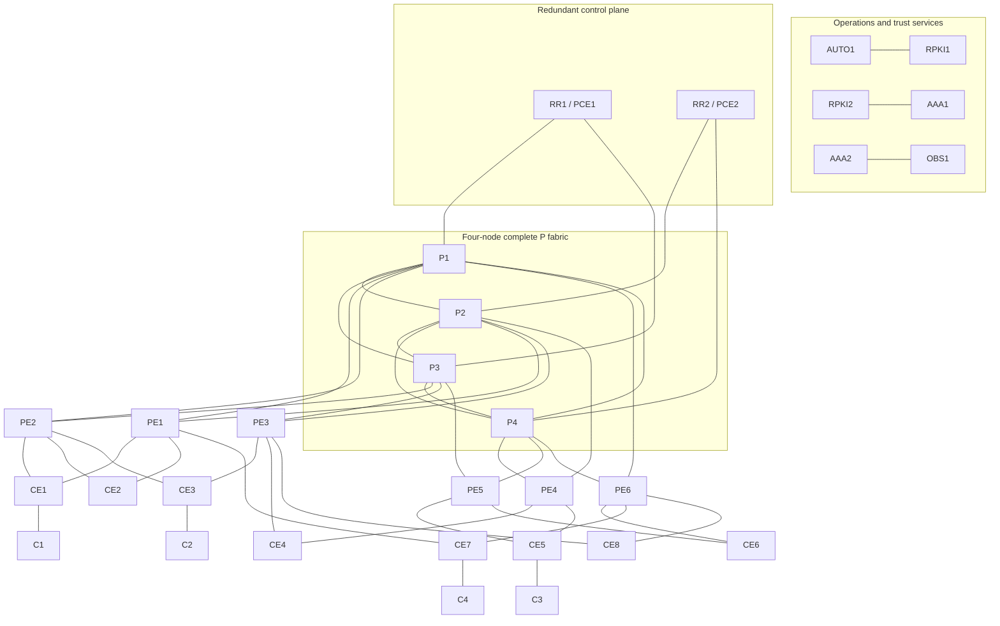

# Full Dataplane Architecture

## Authoritative logical view

## Engineering rationale

The P layer is a complete graph of four routers. The ring gives predictable primary paths; both diagonals remove structural dependence on one rung. Every PE and RR/PCE terminates on two different P routers. Every CE is dual-homed across a PE pair, with varied pairs so EVPN multihoming and VPN failure exercises are not repetitions of one topology.

P and PE nodes use XRd vRouter 26.2.1 for packet forwarding. RR/PCE nodes remain XRd Control Plane 24.2.11 because route reflection and path computation do not justify two additional heavy forwarding VMs. IOL-XE supplies economical CE/client roles.

## Addressing intent

| Function | Allocation |
|---|---|
| Management | `10.205.255.0/24` |
| IPv4 loopbacks | `10.50.0.<node-id>/32` |
| IPv6 loopbacks | `2001:db8:550:abcd::<node-id>/128` |
| IPv4 links | Sequential `/31` from `10.50.255.0/24` |
| IPv6 links | `2001:db8:1500:<link-id>::/127` |
| IS-IS | Area `49.0050`, Level 2 only |
| SRGB | `16000-23999` |

## Acceptance gates

1. Verify and locally build the authorized vRouter image.
2. Validate one vRouter canary, including `igb` interface mapping.
3. Add the P fabric in pairs and measure CPU, RAM, swap, restarts and OOM state.
4. Add PEs, RR/PCEs and IOL nodes in controlled batches; never run another heavy profile concurrently.
5. Require 30/30 management CLI, 42 links bidirectionally for IPv4/IPv6, IS-IS reachability and SR label programming.
6. Preserve this clean foundation; implement PCE, SRv6, EVPN, VPN, multicast, RPKI, AAA and telemetry as separate study phases.

No live acceptance is claimed before these gates produce evidence.
