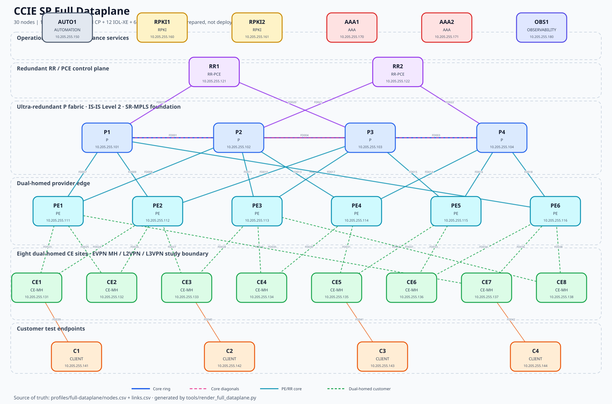

# CCIE SP Full Dataplane Profile

> **Prepared, not deployed.** Image build, single-node canary, staged boot and live acceptance are required before this profile is called runnable.

This isolated 30-node profile adds a real XRd vRouter forwarding plane without replacing the resource-efficient Master profile.



## Architecture

| Role | Count |
|---|---:|
| AAA | 2 |
| AUTOMATION | 1 |
| CE-MH | 8 |
| CLIENT | 4 |
| OBSERVABILITY | 1 |
| P | 4 |
| PE | 6 |
| RPKI | 2 |
| RR-PCE | 2 |

- 42 deterministic dual-stack links.
- Four-P complete graph: ring plus two diagonals.
- Six PEs and two RR/PCEs, all dual-attached to the core.
- Eight CE sites, every one dual-homed for EVPN MH, L2VPN and L3VPN drills.
- Redundant RPKI and AAA placeholders, AUTO1 and OBS1.

## Foundation and study boundary

The generated foundation contains hostnames, loopbacks, link addressing, provider IS-IS Level 2 and SR-MPLS Prefix-SID scaffolding. BGP services, PCE policies, SRv6, EVPN, VPNs, multicast, QoS, RPKI, AAA and telemetry remain student work.

## Resource and safety gate

Target: 96 GiB VM RAM and at least 14 vCPU. Boot no more than two vRouters concurrently. Stop at 80% host RAM, any swap use, sustained load above assigned vCPU, restart or OOM. The ten-vRouter ceiling is a design budget, not a live acceptance claim.

```bash
python3 tools/build_full_dataplane.py
python3 tools/validate_full_dataplane_artifacts.py
sudo containerlab apply -t topology/ccie-sp-full-dataplane.clab.yml --dry-run
```

`tools/build_full_dataplane.py` is the Source of Truth; generated artifacts must not be hand-edited.
