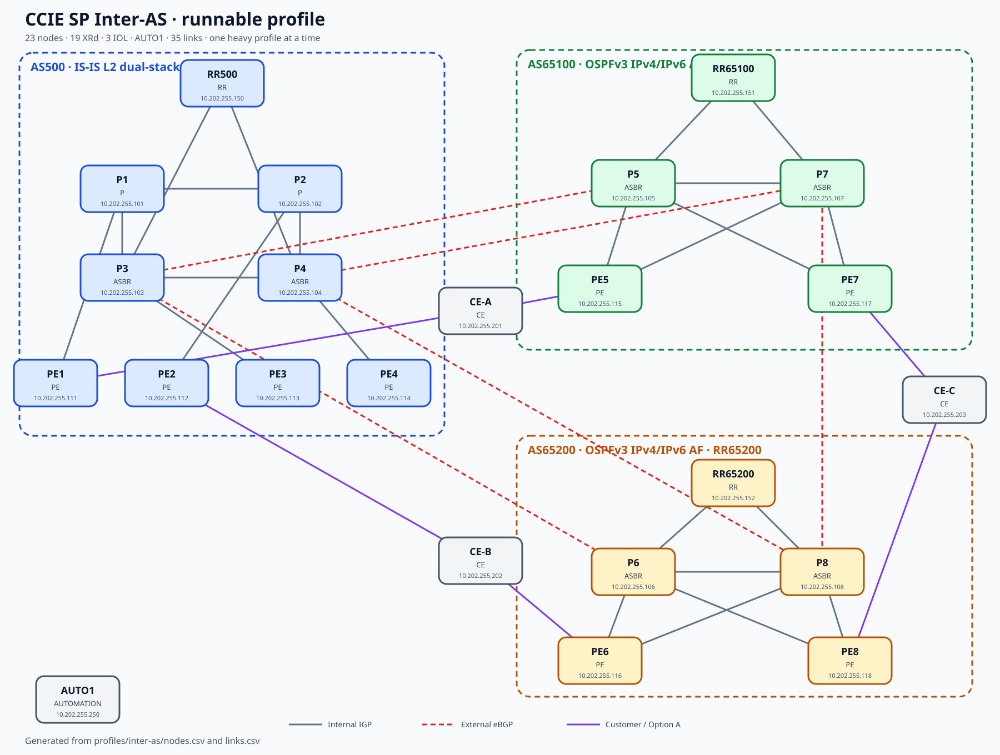

# Inter-AS operations

This profile is isolated from `master` and uses its own management network,
inventory, addressing and configuration phases.

## Scale

- 19 IOS XRd nodes, three IOL customer routers and `AUTO1`.
- AS500: four P/ASBR, four PE and RR500; dual-stack IS-IS Level 2.
- AS65100: two ASBR, two PE and RR65100; OSPFv2 for IPv4 and OSPFv3 for IPv6.
- AS65200: two ASBR, two PE and RR65200; OSPFv2 for IPv4 and OSPFv3 for IPv6.
- 35 links: 24 internal, five inter-provider and six customer links.



## Controlled lifecycle

Never deploy this profile while another `clab-ccie-sp-*` lab is running.

```bash
./labctl status
./labctl deploy inter-as
```

Apply phases serially from `AUTO1`, initially with one or two nodes:

```bash
python3 tools/apply_phase.py 00-base --profile inter-as --nodes P1,P3
python3 tools/apply_phase.py 10-igp --profile inter-as --nodes P1,P3
python3 tools/apply_phase.py 20-bgp --profile inter-as --nodes P3,RR500
```

After each canary succeeds, expand the same phase to the full profile. Validate
all directly connected links with:

```bash
python3 tools/validate_links.py --profile inter-as --family both --workers 2
```

## Acceptance gates

1. 23/23 containers running, zero restarts and zero OOM events.
2. No swap use; at least 12 GiB available inside the VM.
3. All 70 directly connected IPv4/IPv6 tests pass.
4. IS-IS, OSPFv2 and OSPFv3 adjacencies match the inventory.
5. Every PE/ASBR has redundant reachability to its local RR.
6. IPv4/IPv6 eBGP is established on the five external links.
7. Options A, B and C are introduced separately, with rollback between them.
