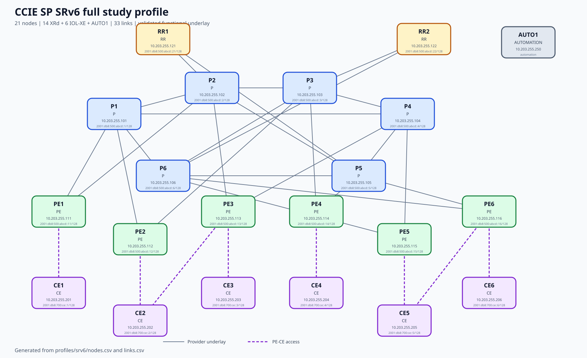

# Full SRv6 lab design

## Design intent

This profile is a reusable service-provider foundation, not a solved workbook.
The validated baseline supplies management access, dual-stack-capable links,
IPv6 addressing and an IS-IS Level 2 provider underlay. SRv6 locators, BGP,
VPN services, traffic engineering and failure policy remain student work.

## Physical and logical structure

| Role | Count | Function |
|---|---:|---|
| P | 6 | Redundant transit backbone and convergence experiments |
| PE | 6 | Service edge for VPN, EVPN, multicast and SRv6 exercises |
| RR | 2 | Redundant MP-BGP route-reflector candidates |
| CE | 6 | Customer edge; CE2 and CE5 are dual-homed |
| AUTO1 | 1 | Ansible, Netmiko, validation and configuration-as-code |

The P ring has three cross-links. Every PE and RR is dual-attached to different
P nodes. This avoids a single transit-node dependency and creates meaningful
paths for metrics, SRv6-TE, TI-LFA and failure injection. Customer links are
outside the provider IGP by design.

## Addressing plan

All prefixes use RFC 3849 documentation space and are intentionally
non-routable on the public Internet.

| Purpose | Block | Allocation rule | Reason |
|---|---|---|---|
| Management | `10.203.255.0/24` | P `.101-.106`, PE `.111-.116`, RR `.121-.122`, CE `.201-.206`, AUTO1 `.250` | Stable out-of-band access independent of routing exercises |
| Provider loopbacks | `2001:db8:500:abcd::/64` | P `::1-::6`, PE `::11-::16`, RR `::21-::22`, all `/128` | Deterministic router IDs and protocol endpoints |
| CE loopbacks | `2001:db8:700:ce::/64` | CE `::1-::6/128` | Customer test prefixes remain visually distinct |
| Provider links | `2001:db8:1000::/40` | One `/127` per link, derived from link ID | RFC 6164 point-to-point efficiency and unambiguous links |
| Access links | `2001:db8:2000::/40` | One `/127` per PE-CE link | Keeps customer attachment separate from the underlay |
| SRv6 locators | `2001:db8:600::/40` | One `/64` per XRd node using its node ID | 40-bit common block plus 24-bit node field matches observed f3216 SID structure |

The authoritative per-node and per-link assignments are
[nodes.csv](nodes.csv) and [links.csv](links.csv). Generated configuration must
be changed through `tools/build_srv6_capability.py`, not by editing individual
files in isolation.

## IGP choice

The provider underlay uses a single IS-IS Level 2 domain named `SRV6`.

- IS-IS carries IPv6 natively and does not require IPv4 transport.
- IOS XR exposes the SRv6 locator and End/End.X sub-TLVs directly in IS-IS.
- Level 2-only operation removes unnecessary L1/L2 leakage from a compact lab.
- Point-to-point interfaces avoid DIS election on two-node links.
- Wide metrics are required for modern SR and traffic-engineering attributes.
- Loopbacks are passive; PE-CE access links are excluded from the provider IGP.

The NET format is deterministic: `49.0001.0000.0000.<node-id>.00`.

## Validated baseline versus exercises

| Layer | Repository baseline | Student exercise |
|---|---|---|
| Management | Complete | AAA/RADIUS/TACACS+, hardening and telemetry |
| Interfaces | IPv6 `/127`, loopbacks and descriptions | MTU, QoS, subinterfaces and failure scenarios |
| Underlay | IS-IS IPv6 L2 | Metrics, Flex-Algo, microloop avoidance and TI-LFA |
| SRv6 | Capability proven separately | Configure locators, IS-IS advertisement, uSID and SRv6-TE |
| BGP | RR nodes and addressing prepared | iBGP, MP-BGP, policies, add-path and ORR |
| Services | PE/CE links prepared | L3VPN, L2VPN, EVPN, multicast and Internet access |
| Automation | AUTO1 present | Ansible workflows, audits, backups and intent validation |

## Capacity and isolation

The live 21-node validation used a 12-vCPU, 60-GiB Ubuntu VM. Stable state used
about 32 GiB with roughly 28 GiB available and no swap. XRd startup created a
large transient CPU queue, so startup is staggered and only one heavy profile
may run at a time.

## Standards basis

- RFC 3849: IPv6 documentation prefix.
- RFC 6164: `/127` prefixes on point-to-point IPv6 links.
- RFC 8200: IPv6 specification.
- RFC 8402: Segment Routing architecture.
- RFC 8754: IPv6 Segment Routing Header.
- RFC 8986: SRv6 network programming behaviors.
- RFC 9256: Segment Routing Policy architecture.
- RFC 9352: IS-IS extensions for SRv6.

See [REFERENCES.md](REFERENCES.md) for direct standards and vendor links.
