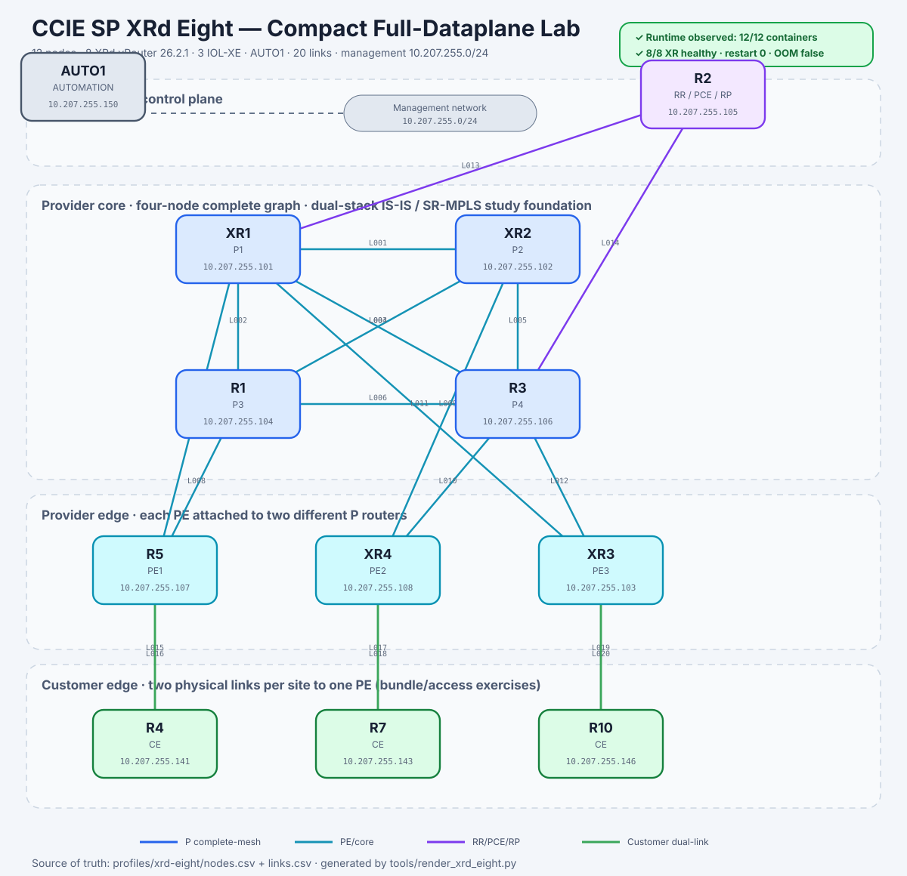

# CCIE SP XRd Eight Profile

> **Compact full-dataplane study environment.** This profile was created for students who need real XRd vRouter forwarding behavior but cannot run the larger Full Dataplane design continuously.



## What was observed live

On 2026-08-06, the Ubuntu host successfully ran all 12 containers:

- eight of eight XRd vRouter nodes reported `healthy`;
- all XRd nodes had `restart=0` and `oom=false`;
- three IOL-XE customer nodes and `AUTO1` were running;
- the VM used approximately 70 GiB of 86 GiB RAM, retained approximately 16 GiB available, and used no swap;
- CPU pressure was high but full CPU stall pressure remained zero.

This evidence accepts the **platform and topology runtime**, not every generated protocol command. During testing, Containerlab reused an older runtime copy of the startup configuration. The current generated `500-SP` foundation is therefore a reproducible candidate, while students may also configure the live routers manually.

## Architecture

| Function | Lab names | Logical names | Platform |
|---|---|---|---|
| Provider core | `XR1`, `XR2`, `R1`, `R3` | P1-P4 | XRd vRouter 26.2.1 |
| Provider edge | `R5`, `XR4`, `XR3` | PE1-PE3 | XRd vRouter 26.2.1 |
| Control-plane services | `R2` | RR / PCE / RP | XRd vRouter 26.2.1 |
| Customer edge | `R4`, `R7`, `R10` | CE1-CE3 | IOL-XE 17.12.1 |
| Operations | `AUTO1` | Automation / AAA / RPKI | Local Linux image |

The four P routers form a complete graph. Each PE connects to two different P routers. The RR/PCE/RP node connects to two P routers. Each CE has two physical links to one PE; these links are intended for bundle, access, subinterface, L2VPN, failure and migration exercises. They do **not** constitute EVPN multihoming until a CE is connected across two different PEs.

## Generated foundation

`tools/build_xrd_eight.py` generates:

- the 12-node Containerlab topology;
- deterministic node and link inventories;
- XR hostnames, login banners, loopbacks and provider link addressing;
- candidate IS-IS Level 2 process `500-SP`;
- candidate IPv4 and IPv6 SR-MPLS Prefix-SIDs;
- BFD and per-prefix fast-reroute intent on provider links;
- intentionally minimal CE configurations;
- profile-local lifecycle commands.

BGP, VPNs, EVPN, PCE policies, multicast, SRv6, QoS, AAA and RPKI policy remain student work.

## Quick start

```bash
cd /srv/netlab/labs/ccie-sp-master
python3 tools/build_xrd_eight.py
python3 tools/render_xrd_eight.py
export CCIE_AUTO_PASSWORD
profiles/xrd-eight/labctl deploy-full
```

Destroy the profile before starting another heavy lab:

```bash
profiles/xrd-eight/labctl destroy
```

The destroy action uses Containerlab `--cleanup` so stale runtime startup files cannot override regenerated artifacts on the next boot.

## Documentation

- [Architecture and design rationale](DESIGN.md)
- [Addressing and link inventory](ADDRESSING.md)
- [Detailed operating procedure](OPERATIONS.md)
- [AUTO1 responsibilities](AUTO1.md)
- [Validation and acceptance boundary](VALIDATION.md)

## Licensed-image boundary

The repository does not distribute Cisco images, signatures, certificates, disk overlays, device backups or runtime secrets. Images must be obtained from an authorized source and built locally.
